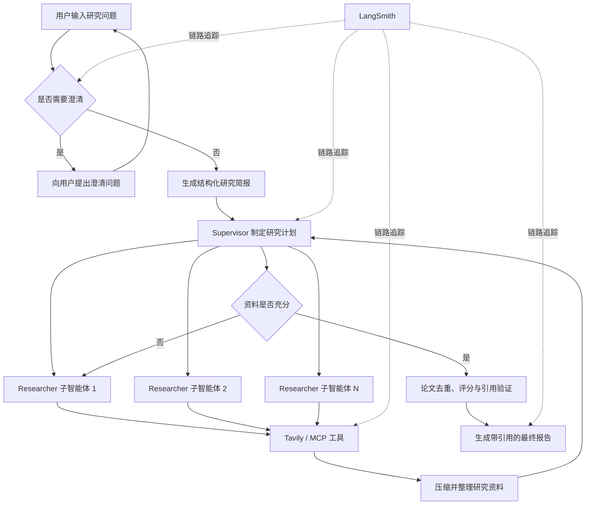

# Deep Research 中文深度研究 Agent

基于 [LangGraph](https://github.com/langchain-ai/langgraph) 构建的多智能体深度研究系统。用户输入研究问题后，系统会自动澄清需求、生成研究简报、拆分子任务、调用 Tavily 检索资料、压缩研究结果，并输出带来源引用的中文研究报告。

本仓库基于 LangChain 官方项目 [open_deep_research](https://github.com/langchain-ai/open_deep_research) 进行二次开发，主要增加了中文提示词与 DeepSeek V4 Pro 兼容支持。

## 项目亮点

- **多智能体协作**：Supervisor 负责任务规划与调度，多个 Researcher 可并发完成子课题研究。
- **完整研究闭环**：覆盖需求澄清、任务规划、联网检索、资料压缩、结果汇总和报告生成。
- **Tool Calling**：模型自主决定搜索时机，通过 Tavily 获取实时网页资料，也可扩展 MCP 工具。
- **学术文献检索**：集成 arXiv、Crossref 与 Semantic Scholar，结构化提取论文元数据并自动补全 DOI、引用指标和开放获取信息。
- **引用可信控制**：按 DOI、arXiv ID 和标题去重，综合相关性、来源质量与学术影响力进行排序并生成引用白名单。
- **DeepSeek V4 Pro 适配**：关闭不兼容的 Thinking Mode，并使用 Function Calling 完成结构化输出。
- **中文化交互**：核心提示词已本地化，支持中文研究任务与中文报告生成。
- **可观测性**：接入 LangSmith，可追踪节点输入输出、工具调用、Token 消耗、耗时与异常。
- **安全与稳定性**：支持调用次数限制、并发限制、结构化输出重试和上下文超限处理。

## 系统架构



## 技术栈

| 类型 | 技术 |
| --- | --- |
| 开发语言 | Python 3.10+ |
| Agent 编排 | LangGraph、LangChain |
| 大语言模型 | DeepSeek V4 Pro（也保留多模型提供商支持） |
| 联网搜索 | Tavily Search API |
| 学术检索 | arXiv、Crossref、Semantic Scholar |
| 工具协议 | Tool Calling、MCP |
| 数据校验 | Pydantic |
| 异步并发 | asyncio |
| 调试追踪 | LangSmith、LangGraph Studio |
| 测试评估 | pytest、Deep Research Bench |

## 工作流程

1. `clarify_with_user` 判断研究范围是否清晰，必要时向用户追问。
2. `write_research_brief` 将对话转换成结构化研究简报。
3. `research_supervisor` 拆分任务并通过 `ConductResearch` 调度子智能体。
4. `researcher` 使用 ReAct 与 Tool Calling 循环调用 Tavily、arXiv、Crossref 或 MCP 工具。
5. `compress_research` 去重、压缩资料并保留来源信息。
6. Supervisor 判断资料是否充分；不足时继续研究，充分时结束调度。
7. `normalize_academic_sources` 解析论文记录，使用 Crossref 和 Semantic Scholar 补全元数据，执行去重、综合评分和引用验证。
8. `final_report_generation` 根据研究笔记和学术引用白名单生成最终报告。

## 项目结构

```text
deep_research/
├── src/
│   ├── open_deep_research/
│   │   ├── configuration.py     # Studio 配置与运行参数
│   │   ├── academic_tools.py    # 学术检索、元数据补全、论文评分和引用验证
│   │   ├── deep_researcher.py   # LangGraph 主图和子图
│   │   ├── model_compat.py      # DeepSeek V4 兼容层
│   │   ├── prompts.py           # 中文提示词
│   │   ├── state.py             # Graph 状态和结构化输出模型
│   │   └── utils.py             # 搜索、MCP、Token 与模型工具
│   ├── legacy/                  # 早期工作流和多智能体实现
│   └── security/                # API 鉴权逻辑
├── tests/                       # 评估脚本与评测器
├── examples/                    # 示例研究报告
├── langgraph.json               # LangGraph 服务入口
├── pyproject.toml               # Python 依赖与项目配置
└── .env.example                 # 环境变量模板
```

## 快速开始

### 1. 克隆仓库

```powershell
git clone https://github.com/lyx001124/deep_research.git
cd deep_research
git switch feat/electronic-literature-agent
```

如果功能分支已经合并到 `main`，可省略最后一条命令。

### 2. 创建 Python 环境

使用 Conda：

```powershell
conda create -n agent python=3.11 -y
conda activate agent
python -m pip install -e .
```

确认开发服务器版本满足 Studio 追踪要求：

```powershell
python -m pip install --upgrade "langgraph-api>=0.11.0" "langgraph-cli[inmem]"
python -m pip check
```

### 3. 配置环境变量

在项目根目录创建 `.env`：

```dotenv
# DeepSeek：两个变量可使用同一个 API Key
OPENAI_API_KEY=your_deepseek_api_key
DEEPSEEK_API_KEY=your_deepseek_api_key
OPENAI_API_BASE=https://api.deepseek.com/v1
DEEPSEEK_API_BASE=https://api.deepseek.com/v1

# 搜索
TAVILY_API_KEY=your_tavily_api_key

# 四个阶段使用的模型
SUMMARIZATION_MODEL=openai:deepseek-v4-pro
RESEARCH_MODEL=openai:deepseek-v4-pro
COMPRESSION_MODEL=openai:deepseek-v4-pro
FINAL_REPORT_MODEL=openai:deepseek-v4-pro

# 本地开发
GET_API_KEYS_FROM_CONFIG=false

# 学术检索与引用验证
ACADEMIC_SEARCH_ENABLED=true
CROSSREF_ENRICHMENT_ENABLED=true
CITATION_VERIFICATION_ENABLED=true
MAX_PAPERS_PER_QUERY=10
MAX_ACADEMIC_PAPERS=20
SEMANTIC_SCHOLAR_ENABLED=true
SEMANTIC_SCHOLAR_ENRICHMENT_ENABLED=true
ACADEMIC_IMPACT_WEIGHT=0.2
# 可选，配置后可提高 Semantic Scholar 限流额度
SEMANTIC_SCHOLAR_API_KEY=your_semantic_scholar_api_key
# PUBLICATION_YEAR_START=2023
# PUBLICATION_YEAR_END=2026

# 可选：LangSmith 链路追踪
LANGSMITH_TRACING=true
LANGSMITH_API_KEY=your_langsmith_api_key
LANGSMITH_PROJECT=deep-research-deepseek-v4
LANGSMITH_ENDPOINT=https://api.smith.langchain.com
```

`.env` 已加入 `.gitignore`，请勿使用 `git add -f .env`，也不要把真实 API Key 写入代码或 README。

### 4. 启动服务

Windows CMD：

```cmd
set PYTHONUTF8=1
langgraph dev --allow-blocking
```

Windows PowerShell：

```powershell
$env:PYTHONUTF8 = "1"
langgraph dev --allow-blocking
```

启动后可访问：

- API：<http://127.0.0.1:2024>
- API 文档：<http://127.0.0.1:2024/docs>
- Studio：终端输出的 LangGraph Studio URL

## Studio 配置

首次测试建议使用低成本配置：

| 配置项 | 建议值 |
| --- | --- |
| Allow Clarification | `False` |
| Max Concurrent Research Units | `1` |
| Search API | `tavily` |
| Max Researcher Iterations | `2` |
| Max React Tool Calls | `3` |
| Summarization Model | `openai:deepseek-v4-pro` |
| Research Model | `openai:deepseek-v4-pro` |
| Compression Model | `openai:deepseek-v4-pro` |
| Final Report Model | `openai:deepseek-v4-pro` |
| MCP Config | 留空 |
| Recursion Limit | `25` |

学术研究配置还提供 `Academic Search Enabled`、`Crossref Enrichment Enabled`、`Semantic Scholar Enabled`、`Semantic Scholar Enrichment Enabled`、`Citation Verification Enabled`、`Academic Impact Weight`、论文数量上限和可选年份范围。

Studio 中保存的 Assistant 配置会参与运行时模型选择，因此需要确认四个模型字段均已改为 DeepSeek V4 Pro。

## 测试问题

简单连通性测试：

```text
什么是信道估计？请搜索两个可靠来源，并用中文简要说明其基本原理、常用方法和工程应用。
```

完整研究流程测试：

```text
请调研近三年大语言模型在无线通信信号处理中的应用，重点比较信道估计、信号检测和频谱感知三个方向的技术路线。至少引用 5 个可靠来源，说明各方案的优势、局限性及工程落地难点，并给出未来研究趋势。
```

## DeepSeek V4 Pro 兼容说明

DeepSeek V4 Pro 在部分 OpenAI 兼容调用中不支持默认 `response_format`，Thinking Mode 也可能与强制 `tool_choice` 冲突。本项目仅对模型名包含 `deepseek-v4` 的模型应用以下适配：

```python
extra_body = {"thinking": {"type": "disabled"}}
structured_output = {"method": "function_calling"}
```

其他模型提供商仍保持 LangChain 的默认行为。兼容逻辑位于 `src/open_deep_research/model_compat.py`。

## LangSmith 调试

开启 `LANGSMITH_TRACING=true` 后，可在 LangSmith 项目中查看：

- 每个 LangGraph 节点的输入和输出
- Supervisor 的任务拆分与 Researcher 调度过程
- DeepSeek 的 Tool Calling 参数
- Tavily 搜索请求与返回结果
- Token 消耗、延迟和异常堆栈

请勿使用包含隐私、密码或敏感资料的问题进行公开追踪测试。

## 后续计划

- [x] 接入 arXiv、Crossref 与 Semantic Scholar 学术检索
- [x] 增加论文去重、来源质量、引用影响力评分与引用白名单检查
- [ ] 支持上传 PDF，并结合本地文档与网络资料研究
- [ ] 增加搜索缓存、成本统计和更完整的自动化测试
- [ ] 导出 Markdown、PDF 和 Word 格式研究报告
- [ ] 使用 Docker 与 CI/CD 完成部署

## 致谢与许可

本项目基于 LangChain 团队的 [open_deep_research](https://github.com/langchain-ai/open_deep_research) 二次开发，感谢原项目作者和贡献者。

项目沿用原仓库的 [MIT License](LICENSE)。
